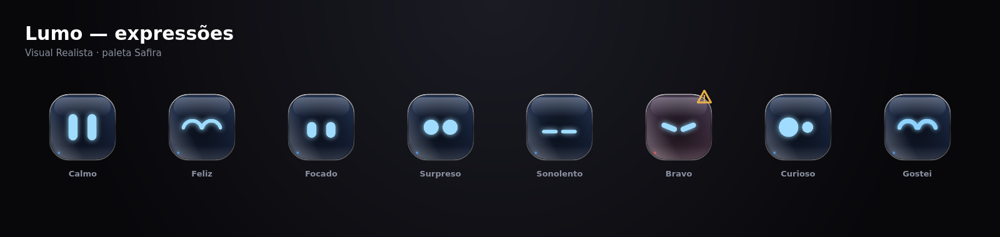

<div align="center">


# Lumo

**O companheiro animado que vive no topo da sua tela.**


*Criado e mantido por **Dalmácio**.*

</div>

> ⚠️ **Projeto em fase de testes e em desenvolvimento.** Pode haver falhas, mudanças de comportamento entre
> versões e recursos incompletos. Foi testado principalmente em **Ubuntu 22.04 com GNOME (Wayland/XWayland)**.
> Ideias, relatos de problemas e melhorias são muito bem-vindos — veja [Como contribuir](#como-contribuir).


## Apresentação

O Lumo é um assistente flutuante para Linux: uma pílula no topo da tela com um personagem animado que
reage ao que você faz. Dele você acessa, sem trocar de janela:

- **Tarefas e lembretes** com aviso na hora certa;
- **Foco**: Pomodoro e modo Não Perturbe;
- **IA** com provedores **gratuitos** (o Groq é grátis e sem cartão; sem chave nenhuma o LLM7 quebra o galho) e agente que pode usar o terminal, sempre com a sua aprovação;
- **Gmail**: aviso de e-mails não lidos (conexão opcional, com o seu próprio cliente OAuth);
- **Sistema**: uso de CPU/RAM/disco, player de mídia e ações rápidas;
- **Terminal** integrado, com as cores da paleta ativa;
- **Estilo**: 6 paletas com personalidade e dois visuais — **Clássico** e **Realista** (vidro polido).



## Observações de uso

- Este é um software **experimental**: use por sua conta e risco e mantenha backup do que for importante.
- O agente de IA pode executar comandos no seu computador. Comandos perigosos ou com `sudo` **sempre** pedem
  aprovação; mesmo assim, leia o que ele vai executar antes de aceitar.
- As **chaves de API** ficam apenas no seu computador. Nunca as publique nem as envie em *issues*.
- Provedores gratuitos têm limites e regras próprios; consulte os termos de cada um (os links estão em Config → IA).
- Os avisos de e-mail usam somente leitura (`gmail.readonly`); o Lumo não envia nem apaga mensagens.
- No Wayland o app roda via XWayland para poder se posicionar no topo da tela.

## Como contribuir

Sugestões, correções e melhorias são bem-vindas:

1. Abra uma **issue** descrevendo o problema ou a ideia (informe distribuição, versão do Lumo e passos para reproduzir).
2. Para enviar código, faça um *fork*, crie uma branch e abra um **pull request** pequeno e focado.
3. Antes de enviar, rode `npm run lint` e `npm run build`.

## Direitos, marca e design

- **Código-fonte**: licença [MIT](LICENSE).
- **Marca e design**: o nome **“Lumo”**, o personagem (formas, expressões e comportamento), o ícone, as paletas e a
  identidade visual são criação de **Dalmácio** e **não** estão cobertos pela licença MIT. Todos os direitos
  reservados: não use o nome, o personagem ou o ícone em produtos, serviços ou distribuições que possam
  sugerir origem ou apoio oficial sem autorização por escrito. Forks são permitidos, desde que usem outro nome e outra identidade visual.
- Projeto independente, inspirado no [Coucou](https://github.com/Louis-CFM/coucou). Marcas de terceiros citadas
  (Google, Gmail, Gemini, OpenAI, Anthropic, Ollama etc.) pertencem aos seus donos; o Lumo não é afiliado a eles.
- Bibliotecas de terceiros mantêm suas próprias licenças (React, Tauri, three.js, xterm.js, anime.js, entre outras).

## Instalar

```bash
git clone https://github.com/dcamk/lumo.git lumo && cd lumo
./install.sh            # instala dependências, compila, instala o .deb e abre o Lumo
./install.sh --build    # força recompilar
./uninstall.sh          # remove (--purge apaga também configurações e a conta Google)
```

Em distribuições sem `apt` (Fedora, Arch…) o `install.sh` compila e instala o **AppImage** em
`~/.local/bin/Lumo.AppImage`, com atalho no menu. Instale antes `nodejs`, `npm`, `rust` e as bibliotecas
WebKitGTK 4.1 / GTK3 / librsvg / OpenSSL / libayatana-appindicator da sua distribuição.

### Primeira configuração (outro computador)

Para a IA responder bem, crie uma chave grátis do **Groq** (1 minuto, sem cartão: Config → IA → Obter chave). Sem chave o Lumo ainda responde pelo LLM7, mas bem pior. Depois, em **Config**:

1. **IA** → escolha um provedor gratuito da lista (cada um tem o link para criar a chave). A chave fica só
   neste PC, na pasta de configuração do app — nunca no repositório.
2. **Contas** (opcional) → conecte o Gmail com o seu próprio cliente OAuth do Google (veja *Conta Google*).
3. **Sistema** → “Iniciar com o sistema”. **Estilo** → paleta e visual.

Para recompilar: `npm install && npm run desktop:build`. Segurança: o repositório não contém chaves,
tokens nem dados pessoais; `.env*`, `instalador/` e `src-tauri/target/` estão no `.gitignore`.

O `install.sh` também limpa sobras de versões antigas: o atalho “Lumo” duplicado no menu (apontava para
`start-lumo-silent.sh`) e um “Iniciar com o sistema” apontando para o binário de desenvolvimento.

Os pacotes ficam em `instalador/` (`.deb` e `.AppImage`). Depois de instalado:

- **Menu de aplicativos** → “Lumo”. Botão direito: Abrir / fechar painel, E-mails, Sistema.
- **Ctrl+Alt+L** abre/fecha o painel com qualquer app em foco (no GNOME vira um atalho do próprio sistema).
- **Iniciar com o sistema**: Config → Sistema.

---

## Como funciona

| Parte | Tecnologia |
|-------|------------|
| Janela nativa transparente, sempre no topo | **Tauri 2** (Rust + WebView) |
| Interface (pílula e painel) | **React + Vite + Tailwind** |
| Animações da interface | **anime.js** (`src/lib/motion.ts`) |
| Personagem / olhos | Canvas 2D (`src/character/`) — 13 expressões + animações ociosas |
| Cursor global (olhos seguem o mouse na tela) | Extensão do GNOME `lumo-cursor@lumo.app` (Wayland) ou X11 → `cursor.rs` |
| Escolha do provedor por disponibilidade | `src/lib/router.ts` |
| Bandeja, atalho, notificações, iniciar com o sistema | `system.rs` |
| Overlay fixo + recorte da janela (XShape), posição salva | `window.rs` |
| Som pelo PipeWire/PulseAudio | `audio.rs` |
| IA com terminal (agente) e arquivos soltos | `agent.rs` |
| Não Perturbe no foco (GNOME / KDE) | `focus.rs` |
| Uso do sistema, mídia (MPRIS), ações rápidas | `linux.rs` |
| IA (streaming) | `api.rs` — Gemini, Claude, Ollama e qualquer API compatível com OpenAI |
| Gmail + Drive | `google.rs` (OAuth de app desktop, PKCE) |
| Sons | Web Audio API (`SoundEngine.ts`) |

### O personagem

- Olhos seguem o cursor **pela tela toda**, mesmo fora da janela (veja “Seguir o cursor no GNOME Wayland”).
- Ao abrir, dá um “oi” animado.
- **Só se mexe sozinho depois de 10 s sem interação com ele** (clicar, arrastar ou passar o mouse por cima).
  Aí alterna entre: passear pela barra, olhar em volta, pulinho, espreguiçar, balançar, piscadinha e bocejo.
- Passar o mouse de um lado para o outro em cima dele = carinho (olhos de coração).
- Chacoalhar ao arrastar = fica tonto. 5 cliques rápidos = bravo; 8 = furioso.
- 90 s sem mexer o mouse/teclado = cochila (Zzz); acorda e se espreguiça quando você volta.
- O tamanho acompanha a janela × o ajuste “Tamanho do Lumo”.

### Modos de janela

1. **Compacto**: pílula preta no topo, só o personagem. Avisos (e-mail novo, lembrete, alerta do sistema)
   alargam a pílula por 6 s; clicar no aviso abre o item.
2. **Painel** (clique no personagem): grade 2×3 de pílulas (**Tarefas, Foco, IA, E-mail, Sistema, Config**),
   o Lumo embaixo à esquerda e o conteúdo à direita. **Puxe o canto de baixo à direita** para aumentar o
   painel (duplo clique na alça volta ao padrão).
3. **Soltar arquivo**: arraste um arquivo do gerenciador de arquivos até o Lumo (em qualquer modo) — ele
   abre uma **boca grande** e **persegue o arquivo pela janela** (a boca vai para baixo do cursor,
   inclinando-se em 3D na direção do movimento) fazendo “aaaa”; solte na boca dele: “nham!”, e ele
   pergunta “o que eu faço com isso?” (com sugestões pelo tipo do arquivo) e leva o arquivo para o chat.

**Posição e tamanho ficam salvos**: arraste o Lumo pela área vazia para outro lugar (perto do topo ele
“gruda” no topo); o tamanho do painel e o “Tamanho do Lumo” também. Config → Geral → **Recentralizar** /
**Painel padrão** desfaz.

### Transições sem rastros (WebKitGTK)

O WebKitGTK tem dois defeitos com janelas transparentes: redimensionar a janela no meio de uma animação
“pula”/deixa rastros, e quando uma área volta a ficar transparente ele não a limpa (fica o desenho antigo).
O Lumo contorna os dois:

- a janela nativa é um **overlay de tamanho fixo** (o do maior estado) que nunca muda durante animações;
- a **casca preta** dentro dela é que estica (morph pílula ↔ painel ↔ soltar arquivo, com mola — anime.js);
- a janela é **recortada no formato da casca a cada quadro** (XShape: cantos de baixo arredondados).
  Fora do recorte nada aparece (nenhum rastro) e o clique atravessa para a janela de baixo.

### Luz e tipografia

A identidade continua (notch preto, gradiente coral → orquídea → violeta, Lumo prateado); a luz passou a
contar o que está acontecendo:

- **Fundo do painel iluminado**: uma poça de luz na cor do humor sai de onde o Lumo está, com um reflexo
  violeta no canto oposto, derivando devagar.
- **Aura** atrás do Lumo, na cor do humor dele — coral feliz, violeta pensando (respira mais rápido),
  azul no foco, âmbar em alerta — e uma **borda de luz** na base da casca.
- **Reações**: concluir tarefa, comando que deu certo/errado, e-mail novo e resposta da IA acendem a
  aura e passam um brilho pela borda; o Lumo fica curioso quando você digita no chat ou quando um
  comando espera aprovação, e muda de jeito ao trocar de aba.
- **Fonte Nunito** (arredondada como o Lumo, embutida — funciona offline). O título de cada aba entra
  letra a letra, em gradiente, com uma onda de brilho; as pílulas ganham um reflexo ao passar o mouse.

### 2D → 3D

O Lumo é desenhado em 2D (canvas), mas em alguns momentos vira “objeto” 3D (perspectiva CSS + reflexo
especular que corre pela face): **entra girando como um cartão** ao abrir o painel, dá um **giro
completo** nas grandes comemorações (todas as tarefas feitas), **se inclina** perseguindo um arquivo e
**balança** ao engolir. Um modo 3D completo (Three.js, com volume e luz reais) é o próximo passo
possível.

### Animações (anime.js)

Todas em `src/lib/motion.ts`, nos elementos marcados com `data-anim="…"`:

- **Abertura**: a pílula nasce de um ponto no topo, estica com mola, o Lumo cai com um quique e soltam faíscas.
- **Troca de modo**: o conteúdo sai, a casca estica/encolhe com mola e o novo conteúdo entra
  (pílulas do painel em cascata).
- **Abas**: o miolo entra com escala 0,98 → 1 e os itens em cascata.
- **Soltar arquivo**: o Lumo de boca aberta balança chamando o arquivo e “engole” quando ele cai.
- **Ações**: tarefa nova desliza, concluir “estala” o círculo, excluir sai para o lado, erro balança o
  campo, badge de e-mail dá um pulinho, barras de CPU/RAM deslizam, o timer pulsa ao iniciar.
- Respeita “reduzir animações” do sistema (`prefers-reduced-motion`).

### Voz de criatura (sons do Lumo)

O Lumo não fala texto — ele faz **sons vocais de bichinho**, sintetizados por formantes
(`src/audio/voice.ts`): uma “corda vocal” passa por filtros que imitam a boca formando vogais, com tom
de criança, vibrato, sopro e pequenas variações a cada vez (cada som tem 2–3 versões sorteadas).

| Momento | Som |
|---|---|
| clique / trocar de aba | gota curtinha (o mais frequente, discreto) |
| deu certo / resposta da IA | “ê-ê!” |
| curioso / esperando aprovação | “hm?” |
| alerta / lembrete | “oh-oh” |
| carinho | “awww” |
| pensando | “hmmm” |
| **arquivo chegando** | “aaaaa” baixinho, de criança esperando a comida (repete enquanto espera) |
| **arquivo na boca** | “glub — nham! mm!” |

### Som sem depender do WebKit

Config → Geral → **Saída de som**: **Sistema** (padrão) sintetiza cada som uma vez num
`OfflineAudioContext` (não toca nada no WebKit) e o Rust toca o WAV pelo servidor de som
(`pw-play` no PipeWire, `paplay` no PulseAudio, `aplay` no ALSA) — `src-tauri/src/audio.rs`.
Assim o som não depende do AudioContext do WebKitGTK (que às vezes fica suspenso ou sai no
dispositivo errado). **WebKit** volta ao Web Audio antigo. O volume do Lumo continua valendo.

### Estilo: paletas com personalidade (v1.6.0)

Aba **Estilo** do painel. Cada paleta muda **cores e personalidade** ao mesmo tempo (`src/theme/palettes.ts`):
quanto mais escura, mais "dark hacker".

| Paleta | Jeito | Sons |
|---|---|---|
| Grafite (padrão) | Executivo, formal, corpo prateado | Discreto |
| Safira | Analista, preciso, olhos de LED azul | Discreto |
| Índigo | Noturno, calmo, brilho violeta | Discreto |
| Âmbar | Estúdio, caloroso e enxuto | Discreto |
| Noir | Sombrio, seco, borda vermelha, glitch raro | Terminal |
| Matrix | Dark hacker: verde fósforo, fonte mono, linhas de varredura, caracteres subindo, glitch | Terminal |

**Visual do corpo (v1.7.0)** — em Estilo → *Visual* dá para alternar entre **Clássico** (desenho limpo, o
padrão) e **Realista** (vidro escuro polido, com reflexos, bisel, LED na base e olhos com brilho forte). O
modo vale para qualquer paleta e também aparece na prévia 3D (`look` em `src/theme/store.ts`; o desenho
fica em `drawGlassBody`, `src/character/draw.ts`). O **Terminal** do painel usa as cores da paleta ativa
(fundo, texto, cursor, sugestões da IA e botões).

- A paleta define: cores da interface (variáveis CSS em `:root`, escritas por `src/theme/store.ts`), desenho do
  personagem (corpo de vidro/metal, olhos de LED, cantos), **perfil de movimento** (squash, altura dos pulos,
  mola, glitch, comportamentos espontâneos), **timbre dos sons** (`src/audio/cues.ts`: discreto / terminal /
  criatura — dá para forçar um em Estilo → Sons) e o **tom da IA** (`persona` entra no prompt do agente).
- Trocar de paleta faz a casca "recalibrar" (clarão de borda + piscada; nas paletas terminal, um pico de glitch).
- Prévia 3D (three.js, carregado só quando a aba abre; cai para 2D se o WebGL falhar): `src/components/Lumo3D.tsx`.
- Visual profissional: sem corações, estrelas, bochechas nem confete — "carinho" vira sorriso de LED com anéis,
  tontura vira anel de carregamento, raiva vira triângulo de aviso. "Reduzir movimento" do sistema é respeitado.

### Atalhos e integração com o sistema

- **Ctrl+Alt+L** abre/fecha o painel. No GNOME o Lumo registra um atalho personalizado do sistema
  (Configurações → Teclado → Atalhos personalizados → “Lumo”), que funciona mesmo com apps Wayland em foco.
  Liga/desliga em Config → Sistema. Fora do GNOME usa o atalho global do X11.
- `lumo-assistant --toggle` abre/fecha; `--tab=mail|linux|tasks|focus|chat|settings` abre numa aba;
  `lumo-assistant --ask "instale o VLC"` abre o chat e já envia o pedido (bom para atalhos de teclado).
  Só existe um Lumo por vez: o pedido é repassado para a instância aberta.
- **Bandeja**: abrir/fechar, E-mails, Sistema, Configurações, silenciar, sair.
- **Notificações do sistema**: fim do Pomodoro, lembretes, e-mail novo, alertas de RAM/disco/temperatura/bateria.
- **Não Perturbe** durante o foco: GNOME (`show-banners`) e KDE Plasma. O Lumo só desfaz o que ele mesmo
  ligou e restaura ao sair.
- **Iniciar com o sistema** usa sempre o executável instalado (`/usr/bin/lumo-assistant` ou o AppImage).
  O binário de desenvolvimento nunca é usado: ele depende do `npm run desktop` e, sem ele, mostraria
  só uma página de erro.

### Tarefas e lembretes

Escreva o lembrete junto com a tarefa: `beber água em 20m`, `ligar pro João em 1h30`,
`reunião às 15:30`, `pagar conta @9h`. Na hora: notificação, aviso na pílula e som.
“Limpar feitas” remove as concluídas.

### Sistema (aba do painel)

- **Uso**: CPU (passe o mouse para ver os processos mais pesados), RAM, disco `/`, temperatura ou bateria,
  rede ↓↑, tempo ligado e carga. Lido direto de `/proc` e `/sys`.
- **Mídia**: o que está tocando (Spotify, Firefox, Rhythmbox… via MPRIS) com anterior/tocar/próxima.
- **Ações rápidas**: Terminal, Atualizar sistema (abre no terminal), Monitor, Meu IP, Discos, Portas,
  Bloquear tela, e as suas: **+** → nome, comando e como executar (mostrar a saída / no terminal / abrir programa).
- **Alertas** (Config → Sistema): RAM ≥ 92%, disco ≥ 95%, temperatura ≥ 90 °C, bateria ≤ 15%.

### IA: provedores gratuitos

Config → IA. Os gratuitos vêm do diretório
[awesome-free-llm-apis](https://github.com/open-free-llm-api/awesome-freellm-apis) e quase todos falam o
formato da OpenAI (`src/lib/providers.ts`):

| Provedor | Chave | Observação |
|---|---|---|
| **Groq** | grátis, sem cartão | padrão e recomendado: `openai/gpt-oss-120b`, rápido, ~1.000 pedidos/dia |
| Gemini | grátis (AI Studio), sem cartão | `gemini-flash-latest`; ótimo com documentos grandes |
| GitHub Models | grátis com a conta do GitHub | token com permissão “Models”; poucos pedidos/dia, modelos fortes (`openai/gpt-4.1-mini`) |
| LLM7 | não precisa | último recurso: responde mal e vive lotado |
| OpenRouter | grátis | “Listar” mostra só os modelos `:free` |
| Cerebras, Mistral, NVIDIA NIM, Hugging Face | grátis | |
| OpenAI, Claude | pagos | |
| Personalizado | — | qualquer API compatível com OpenAI (URL base + chave) |
| Ollama | — | modelos locais |

- **Obter chave** abre a página do provedor; **Listar** busca os modelos disponíveis agora (os gratuitos
  mudam com frequência). Se o modelo padrão de um provedor sair do ar, o Lumo troca sozinho por outro da
  mesma conta; Config → IA → **Status** mostra quem está respondendo.
- **Plano B**: se o provedor der limite/erro antes de responder, o Lumo tenta outro gratuito que tenha chave
  (a bolha mostra “respondido via …”).
- Blocos `<think>…</think>` de modelos de raciocínio não aparecem na resposta.

### Provedor de IA automático

O chat escolhe o provedor pela disponibilidade, a cada mensagem:

1. o configurado em Config → IA (sempre ele, enquanto responder);
2. os outros gratuitos que têm chave; por último o LLM7 (sem chave). Provedores **pagos** (OpenAI, Claude)
   só são usados quando são o escolhido — o Lumo nunca gasta créditos por conta própria;
3. os modelos do **Ollama** instalados que aceitam ferramentas — o configurado e, se ele demorar, os
   **menores** (respondem mais rápido).

Cada tentativa tem tempo-limite (45 s na nuvem, 90 s no local). Quem falha (limite da cota, fora do ar,
lento, modelo inexistente) fica de lado por alguns minutos e o chat avisa numa linha discreta
(“Groq não respondeu — tentando Ollama (qwen2.5)”); a resposta mostra “respondido via …”.

### IA com acesso ao terminal

No app, a IA do chat é um **agente**: para cumprir o pedido ela pode rodar comandos no seu terminal,
ler e gravar arquivos. Exemplos: “instale o VLC”, “instale este programa:
https://github.com/…”, “converta este PDF em texto”, “quanto espaço livre eu tenho?”.

- Cada comando aparece num cartão com a explicação e **Executar / Recusar**; a saída aparece ao vivo.
  Config → IA → **Comandos** pode executar sem perguntar — **menos** `sudo` e comandos perigosos.
- **A conversa tem memória**: as falas e o que foi executado (comando, resultado e o fim da saída) vão
  de contexto para as próximas mensagens, em qualquer provedor. **Nova conversa** (no topo do chat)
  esquece tudo e começa do zero.
- Funciona com modelos locais ou não: ferramentas nativas quando o modelo aceita; chamadas escritas no
  texto (`<tool_call>`, bloco ```json) também são entendidas; modelos sem ferramentas usam o modo texto.
  Se o modelo repetir a mesma ação, o Lumo devolve o resultado anterior em vez de rodar de novo.
- `sudo` pede a senha numa **janela gráfica** (zenity) — a senha nunca passa pelo chat nem pela IA.
- Para instalar, a IA segue: apt → `.deb` oficial → Flatpak → AppImage; para links do GitHub ela
  procura o `.deb`/`.AppImage` certo na última release.
- **Parar** (botão quadrado) cancela e encerra o comando em execução.
- Funciona com ferramentas nativas em Groq, OpenRouter, Cerebras, Mistral, NVIDIA, Gemini, OpenAI,
  Claude e **Ollama** (ex.: `gemma4:e4b`, `qwen2.5`, `llama3.1` — modelos com suporte a *tools*).
  O LLM7 sem chave não aceita ferramentas: o Lumo usa um modo texto (`<run>…</run>`) automaticamente.
- Arquivos soltos no Lumo chegam à IA com o **caminho real**; ela lê texto direto e inspeciona o resto
  com comandos (`pdftotext`, `file`, `unzip -l`, `ffprobe`…).
- Código: `src-tauri/src/agent.rs` (laço, ferramentas, aprovação) e `src/hooks/useChat.ts`.

### Terminal (aba do painel)

A aba **Terminal** é um terminal comum (bash num pseudoterminal, desenhado com xterm.js) no visual do painel. Ele carrega o seu `~/.bashrc`, continua aberto ao trocar de aba e entende cores, `vim`, `htop` etc.

A IA acompanha o que roda: a cada comando concluído o bash avisa o Lumo (sequência invisível OSC 777 com código de saída e comando). Se o comando falhar (menos Ctrl+C/Ctrl+Z), a IA — pela mesma fila de provedores do chat — explica a causa em uma frase e sugere **um** comando, com os botões **Inserir** (escreve no prompt) e **Executar**. Nada roda sem você clicar. O botão "IA acompanhando" no cabeçalho liga/desliga.

### Inatividade, rosto faminto e 2,5D

- Comportamentos sozinhos começam após 30 s sem interação; o cochilo, após 5 min.
- Ao arrastar um arquivo, o rosto vira uma porta de recebimento (olhos em barras finas e uma fenda com setas descendo) e o Lumo segue o arquivo até você soltar.
- 2,5D (técnica do Coucou): a cabeça vira para o cursor (rosto desliza, olho de trás afina, sombra lateral) quando ele está animado; calmo, volta ao 2D.

### Conta Google (Gmail + Drive)

Config → **Contas**. Configuração única (o Google exige um cliente OAuth próprio):

1. No [Google Cloud Console](https://console.cloud.google.com/apis/credentials) crie um projeto e ative a
   **API do Gmail** (e a do Drive, se quiser enviar arquivos).
2. Tela de consentimento OAuth: tipo “Externo”, e adicione seu e-mail em **Usuários de teste**.
3. Credenciais → **ID do cliente OAuth** → tipo **App para computador**. Cole o Client ID e o secret no
   Lumo e clique **Salvar** (ficam em `~/.config/com.lumo.assistant/google-client.json`, permissão 0600).
4. **Conectar** abre o navegador (retorno em `127.0.0.1`, PKCE).

Depois de conectado:
- Aba **E-mail**: não lidos (contagem real da caixa de entrada) com remetente, assunto e trecho; clique
  abre a conversa no Gmail.
- E-mail novo → aviso na pílula (clique abre o e-mail), badge com a contagem e, se ligado,
  notificação do sistema. Intervalo: 1, 2, 5 ou 15 min.
- Escopos mínimos: `gmail.readonly` e `drive.file` (o Lumo só enxerga no Drive o que ele mesmo enviou).
- O refresh token fica em `~/.config/com.lumo.assistant/google.json` (0600). **Desconectar** revoga e apaga.

Alternativa para distribuir: `LUMO_GOOGLE_CLIENT_ID` / `LUMO_GOOGLE_CLIENT_SECRET` no ambiente ou no build.
Testar o aviso sem conta: no console do WebView, `lumoDebug.fakeEmail('Ana', 'Reunião às 15h')`.

### Olhos e cursor

Config → Geral → **Olhar**: **Só Lumo** (olhos seguem o mouse sobre a janela do Lumo — sempre
funciona) ou **Tela inteira** (posição global via Rust). Se as coordenadas globais divergirem do
mouse real, o Lumo volta sozinho para **Só Lumo**. O poll global nunca conta como “interação”.

#### Tela inteira no GNOME Wayland

O Wayland não deixa um app saber onde o mouse está fora da própria janela. A alternativa é uma
extensão mínima do GNOME Shell que só responde “onde está o cursor?” pelo D-Bus (`org.lumo.Cursor`).
Código: `src-tauri/gnome-extension/`.

1. Config → Geral → Olhar: Tela inteira → **Extensão GNOME**.
2. **Saia da sessão e entre de novo** — o GNOME no Wayland só carrega extensões novas no login.

Feita para GNOME 42–44 (Ubuntu 22.04). Para remover: `gnome-extensions disable lumo-cursor@lumo.app` e
apague `~/.local/share/gnome-shell/extensions/lumo-cursor@lumo.app`.

---

## Desenvolvimento

Requisitos (Ubuntu): Node.js 18+, Rust (`rustup`) e as bibliotecas do WebKit/GTK
(o `install.sh` instala as que faltarem):

```bash
sudo apt install -y libwebkit2gtk-4.1-dev build-essential curl wget file \
  libxdo-dev libssl-dev libayatana-appindicator3-dev librsvg2-dev libgtk-3-dev
```

```bash
npm install
npm run desktop        # app nativo com recarga ao vivo
npm run dev            # só a interface no navegador (http://localhost:1420)
npm run lint           # checagem de tipos
npm run desktop:build  # gera .deb e .AppImage em src-tauri/target/release/bundle/
```

O binário de `npm run desktop` (`target/debug/`) carrega a interface do servidor de desenvolvimento —
não serve para “iniciar com o sistema” nem para atalhos; use o instalado.

### Variáveis de ambiente

| Variável | Efeito |
|----------|--------|
| `LUMO_ALWAYS_ON_TOP=0` | Não fica sobre as outras janelas |
| `LUMO_WAYLAND=1` | Não força XWayland (perde posição no topo / sempre no topo) |
| `LUMO_SAFE_RENDER=1` | Desliga a composição acelerada do WebKit (fundo preto ou rastros) |
| `PULSE_SINK=<nome>` | Força a saída de áudio do Lumo para um dispositivo (ex.: DAC USB) |
| `LUMO_GOOGLE_CLIENT_ID` / `LUMO_GOOGLE_CLIENT_SECRET` | Cliente OAuth do Google (alternativa à Config) |

No **Wayland** o app não pode se posicionar sozinho nem ficar “sempre no topo”, por isso o Lumo roda via
**XWayland** automaticamente (`GDK_BACKEND=x11`) e já define `WEBKIT_DISABLE_DMABUF_RENDERER=1`.

---

## Problemas comuns

| Sintoma | Causa provável | O que fazer |
|---------|----------------|-------------|
| Mensagem de erro fixa no lugar do Lumo ao ligar o PC | “Iniciar com o sistema” apontava para o binário de debug | `./install.sh` corrige; ou desligue e ligue de novo em Config → Sistema |
| Dois “Lumo” no menu | Atalho antigo do `install-desktop.sh` | `./install.sh` remove o duplicado |
| Ctrl+Alt+L não responde | Atalho do GNOME desligado | Config → Sistema → Atalho |
| IA: “model unavailable” / 404 | Os modelos gratuitos mudam | Config → IA → **Listar** e escolha outro |
| IA: HTTP 429 | Limite da camada grátis | Ligue o **Plano B** e configure mais de um provedor |
| Google: “acesso bloqueado” | Seu e-mail não está em Usuários de teste | Adicione na tela de consentimento OAuth |
| Não fica sobre outras janelas | Wayland ou “Fixar no topo” desligado | Config → Geral; confirme `LUMO_ALWAYS_ON_TOP` ≠ 0 |
| Olhos não seguem o cursor longe da janela | GNOME **Wayland** | Instale a extensão do GNOME e faça logout/login |
| Fundo preto | Renderizador do WebKitGTK | `LUMO_SAFE_RENDER=1` |
| Sem som | WebKit sem áudio | Config → Geral → Saída de som: **Sistema** |
| A IA não executa comandos | Modelo sem suporte a ferramentas | Use Groq/OpenRouter/Gemini ou um modelo Ollama com *tools* |

### Sem som

1. Config → Geral → **Som**: se aparecer “mudo” (amarelo), clique no alto-falante.
2. **Testar** toca um bipe de 440 Hz ignorando o volume do Lumo. Motor `running` e nada audível = saída
   em outro dispositivo.
3. O áudio sai pelo processo `WebKitWebProcess`: `pactl list sink-inputs short` e
   `pactl move-sink-input <id> <saída>`, ou use o **pavucontrol** (aba “Reprodução”).
   Para fixar: `PULSE_SINK=<nome-da-saída> lumo-assistant`.
4. GStreamer: `sudo apt install gstreamer1.0-plugins-good gstreamer1.0-pulseaudio`.

---

## Config (aba do painel)

- **Geral**: som (mudo, volume, Testar), tamanho do Lumo, fixar no topo, olhar (só Lumo / tela inteira).
- **IA**: provedor, chave (+ Obter chave), modelo (+ Listar), URL base (personalizado/Ollama), Plano B.
- **Contas**: Google (configurar, conectar, notificar, intervalo).
- **Sistema**: iniciar com o sistema, atalho do GNOME, alertas, distro/kernel/sessão.

Tarefas, configurações e ações rápidas persistem entre reinícios.

---

## Estrutura

```
install.sh / uninstall.sh     # instalar, atualizar e remover
src/
  App.tsx                     # orquestra modos, avisos, emoções e abas
  types/index.ts              # tipos + configurações padrão
  lib/
    tauri.ts                  # ponte com o Rust (invoke / tryInvoke / listen)
    motion.ts                 # todas as animações (anime.js)
    providers.ts              # provedores de IA (gratuitos, pagos, local)
    router.ts                 # fila por disponibilidade, tempo-limite e troca de modelo local
    reminders.ts              # “… em 20m” / “… às 15:30”
    layout.ts                 # fonte única de tamanho (lumoScale → personagem + janela)
    usePersistentState.ts     # estado salvo no localStorage
  hooks/
    useWindowMode.ts          # pílula ↔ painel ↔ soltar arquivo, morph e recorte da janela
    useFileDrop.ts            # arquivos arrastados para a janela (caminhos reais)
    useChat.ts  useTasks.ts  useGoogle.ts  useSystem.ts  usePomodoro.ts  useEmotion.ts …
  api/aiService.ts            # chat → Rust (app) ou Express (navegador)
  audio/SoundEngine.ts        # sintetizador dos sons
  character/                  # personagem (canvas, comportamentos, arrastar com mola)
  components/
    CompactBar.tsx  QuickPanel.tsx  DropView.tsx  RichText.tsx
    tabs/  TasksTab  FocusTab  ChatTab  MailTab  LinuxTab  SettingsTab
src-tauri/src/
  main.rs     # ambiente Linux, plugins, comandos, linha de comando (--toggle / --tab=)
  system.rs   # bandeja, notificações, iniciar com o sistema, atalho do GNOME
  window.rs   # overlay fixo, recorte (XShape), posição salva, sempre no topo
  focus.rs    # Não Perturbe (GNOME / KDE)
  linux.rs    # uso do sistema, mídia (MPRIS), ações rápidas, abrir links
  api.rs      # IA com streaming + lista de modelos
  google.rs   # OAuth Google, Gmail e Drive
  cursor.rs   # cursor global (extensão GNOME → X11)
  agent.rs    # IA com terminal: comandos com aprovação, ler/gravar arquivos, arquivos soltos
  audio.rs    # sons pelo PipeWire/PulseAudio
src-tauri/gnome-extension/    # extensão lumo-cursor@lumo.app (GNOME 42–44)
src-tauri/icons/icon-source.png  # ícone em 1024 px (gera os demais)
server.ts     # servidor de desenvolvimento (só para rodar no navegador)
```

---

© 2026 Dalmácio. Código sob [MIT](LICENSE); marca e design conforme [Direitos, marca e design](#direitos-marca-e-design).
