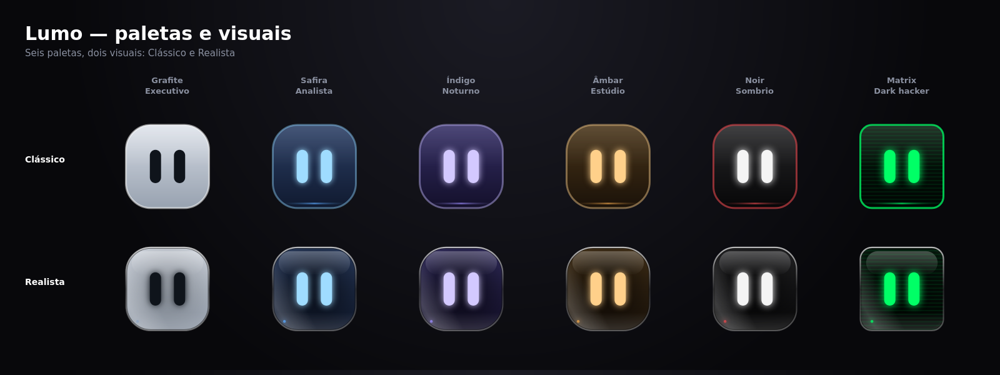

# Lumo

Assistente de área de trabalho para Linux: uma pílula preta no topo da tela com um personagem animado.
Tarefas com lembretes, foco (Pomodoro), terminal, avisos de e-mail, painel do sistema e uma **IA com
equipe de agentes** que roda comandos, lembra de você e usa skills e plugins. Funciona sem chave de API.


## Instalar

```bash
git clone https://github.com/dcamk/lumo.git && cd lumo
./install.sh            # compila, instala o .deb e abre o Lumo
./install.sh --build    # força recompilar
./uninstall.sh          # remove (--purge apaga também configurações)
```

Sem `apt` (Fedora, Arch…), o script instala o AppImage em `~/.local/bin/Lumo.AppImage`. Instale antes
`nodejs`, `npm`, `rust` e as bibliotecas WebKitGTK 4.1, GTK3, librsvg, OpenSSL e libayatana-appindicator.

Depois de instalado: **Ctrl+Alt+L** abre e fecha o painel; o clique direito na bandeja tem atalhos;
**Config → Sistema** liga “Iniciar com o sistema”.

## IA

Config → **IA**. Sem configurar nada, o Lumo usa o LLM7 (sem chave) e os modelos do Ollama que você já
tiver. Chaves gratuitas extras (Groq, Cerebras, Gemini, Mistral, NVIDIA, OpenRouter, Hugging Face) dão
mais fôlego; OpenAI e Claude também funcionam. As chaves ficam só neste PC.

**Como funciona** (`src-tauri/src/brain/`)

- **Provedores testados antes do uso**: o Lumo mede latência, confere a chave e vê se o modelo aceita
  ferramentas, ao abrir e a cada ~20 min. Quem bate no limite fica em pausa e volta sozinho. O ranking
  prefere os de maior limite diário e mais rápidos. Config → IA → **Equipe de modelos** mostra o estado.
- **Modelo principal + especialistas**: o principal conversa com você e delega a `coder`, `long`
  (documentos grandes), `fast` ou `local` (dados privados, nunca saem do PC). Relatórios e erros dos
  especialistas ficam com o principal, que diz só o necessário.
- **Terminal e arquivos**: o agente roda comandos e lê/grava arquivos. Cada ação pede aprovação
  (`sudo` pede a senha numa janela gráfica; o Lumo nunca a vê). Config → IA → **Comandos** executa sem
  perguntar, exceto `sudo` e comandos perigosos. **Parar** cancela na hora.
- **Memória**: guarda fatos duradouros sobre você, mantém a conversa entre reinícios e resume o que
  fica antigo. Edite em Config → **Agente**.
- **Skills**: pastas com `SKILL.md`. Instale por `dono/repo`, pasta ou URL (Config → Agente ou pelo chat).
- **Plugins MCP**: servidores MCP por stdio (ex.: `npx -y @modelcontextprotocol/server-filesystem ~`).
  Cada uso pede aprovação, a menos que o plugin esteja marcado como confiável.
- **Failover sem perder o fio**: limite (429), servidor fora do ar (5xx), rede caída ou lentidão
  trocam de provedor na hora, sem insistir no mesmo. Quem não aceita ferramentas não é forçado a
  simulá-las: o próximo provedor compatível assume (o modo texto fica só como último recurso). Quem
  assume uma tarefa no meio recebe o resumo do que já foi feito e não repete. Detalhes em
  [`docs/continuidade-e-failover.md`](docs/continuidade-e-failover.md).
- A resposta aparece aos poucos. Arquivos arrastados para o Lumo chegam à IA com o caminho real.

Dados do cérebro em `~/.config/com.lumo.assistant/`: `memory.json`, `plugins.json`, `skills/`.

## Painel

Clique no personagem. Abas: **Tarefas**, **Foco**, **IA**, **E-mail**, **Sistema**, **Terminal**,
**Estilo**, **Config**. Puxe o canto inferior direito para aumentar; a posição e o tamanho ficam salvos.

- **Tarefas**: escreva o lembrete junto: `beber água em 20m`, `reunião às 15:30`, `pagar conta @9h`.
- **Foco**: Pomodoro com Não Perturbe (GNOME e KDE).
- **Sistema**: CPU, RAM, disco, temperatura/bateria, rede, player de mídia (MPRIS) e ações rápidas
  próprias. Alertas de RAM, disco, temperatura e bateria.
- **Terminal**: bash de verdade (xterm.js). Quando um comando falha, a IA explica e sugere um comando
  com **Inserir** e **Executar**; nada roda sem clique.
- **Estilo**: paletas com cores, personalidade e sons próprios (Grafite, Safira, Índigo, Âmbar, Noir,
  Matrix) e visual **Clássico** ou **Realista**.



### O personagem

- Olhos seguem o cursor pela tela toda; carinho, tontura, raiva e sono reagem ao que você faz.
- Sozinho, só depois de 30 s sem interação: passeia, olha em volta, espreguiça, boceja. Cochila após 5 min.
- Arraste um arquivo até ele: abre a boca, persegue o arquivo, “engole” e pergunta o que fazer.
- Sons de criatura sintetizados (nada de voz falada). Respeita “reduzir animações” do sistema.

### Contas Google (Gmail e Drive)

Config → Contas → **Entrar com Google**. O app precisa de um cliente OAuth embutido, criado **uma vez por
quem compila**:

1. No [Google Cloud Console](https://console.cloud.google.com/apis/credentials), ative as APIs do Gmail e
   do Drive e crie um ID de cliente OAuth do tipo **App para computador**.
2. Salve o JSON baixado em `src-tauri/google-client.json` (já no `.gitignore`) e recompile.

Sem o JSON, a tela aceita o Client ID (ou o JSON inteiro colado). Enquanto o app não for verificado pelo
Google, adicione o e-mail em **Usuários de teste** (senão: “acesso bloqueado”); o login expira em 7 dias,
a menos que o app seja publicado. Escopos: `gmail.readonly` e `drive.file`. O token fica em
`~/.config/com.lumo.assistant/google.json` (0600); **Desconectar** revoga e apaga.

### Linha de comando

```bash
lumo-assistant --toggle              # abre/fecha o painel
lumo-assistant --tab=chat            # abre numa aba (tasks, focus, chat, mail, linux, settings)
lumo-assistant --ask "instale o VLC" # abre o chat e envia o pedido
lumo-assistant --notice "Título | texto"  # aviso na pílula + notificação do sistema
```

## Olhos fora da janela (GNOME Wayland)

O Wayland não informa a posição do mouse fora da janela. Config → Geral → Olhar: **Tela inteira** →
**Extensão GNOME** instala uma extensão mínima (`src-tauri/gnome-extension/`, GNOME 42–44), e depois é
preciso **sair da sessão e entrar de novo**. Remover: `gnome-extensions disable lumo-cursor@lumo.app`.
No Xorg funciona sem extensão.

## Desenvolvimento

Requisitos: Node.js 18+, Rust e as bibliotecas do WebKit/GTK (o `install.sh` instala as que faltarem).

```bash
npm install
npm run desktop         # app nativo com recarga ao vivo
npm run dev             # só a interface, no navegador (http://localhost:1420)
npm run lint            # checagem de tipos
npm run desktop:build   # .deb e .AppImage em src-tauri/target/release/bundle/
cd src-tauri && cargo test brain   # testes do cérebro (alguns usam o Ollama local)
```

O binário de `npm run desktop` depende do servidor de desenvolvimento; para iniciar com o sistema use o
instalado.

| Variável | Efeito |
|---|---|
| `LUMO_ALWAYS_ON_TOP=0` | Não fica sobre as outras janelas |
| `LUMO_WAYLAND=1` | Não força XWayland (perde posição no topo e “sempre no topo”) |
| `LUMO_SAFE_RENDER=1` | Desliga a composição acelerada do WebKit (fundo preto) |
| `PULSE_SINK=<saída>` | Força a saída de áudio |
| `LUMO_GOOGLE_CLIENT_ID` / `LUMO_GOOGLE_CLIENT_SECRET` | Cliente OAuth do Google |

No Wayland o Lumo roda via XWayland (`GDK_BACKEND=x11`) para poder se posicionar.

## Problemas comuns

| Sintoma | O que fazer |
|---|---|
| Erro fixo no lugar do Lumo ao ligar o PC | `./install.sh` (o autostart apontava para o binário de debug) |
| Ctrl+Alt+L não responde | Config → Sistema → Atalho |
| Chat lento | Configure uma chave gratuita (Groq, Cerebras ou Gemini); modelos locais demoram a carregar na primeira resposta |
| “Nenhum modelo respondeu” | Config → IA → **Testar agora**; confira as chaves e a internet |
| LLM7 com “quota exceeded” | A cota diária sem chave acabou; use outro provedor |
| Google: “acesso bloqueado” | Adicione seu e-mail em Usuários de teste (veja Contas Google) |
| Olhos não seguem o cursor longe da janela | Instale a extensão GNOME e reinicie a sessão |
| Fundo preto | `LUMO_SAFE_RENDER=1` |
| Sem som | Config → Geral → Saída de som: **Sistema**; teste com **Testar** |
| O agente não executa comandos | O modelo precisa aceitar ferramentas (Groq, Gemini, OpenRouter, Ollama com *tools*) |

## Estrutura

```
install.sh, uninstall.sh
src/                       interface React
  App.tsx                  modos, avisos e abas
  hooks/                   useChat, useBrain, useGoogle, useWindowMode, useFileDrop…
  components/tabs/         Tarefas, Foco, Chat, E-mail, Linux, Terminal, Estilo, Config, Agente
  character/               personagem (canvas)
  audio/                   sons sintetizados
  lib/motion.ts            animações (anime.js)
src-tauri/src/
  brain/                   pool de provedores, orquestrador, memória, skills, plugins MCP
  agent.rs                 terminal e aprovações do agente
  window.rs, system.rs, linux.rs, focus.rs, audio.rs, cursor.rs, google.rs, api.rs, terminal.rs
src-tauri/gnome-extension/ extensão do cursor
```


Licença: [MIT](LICENSE).
